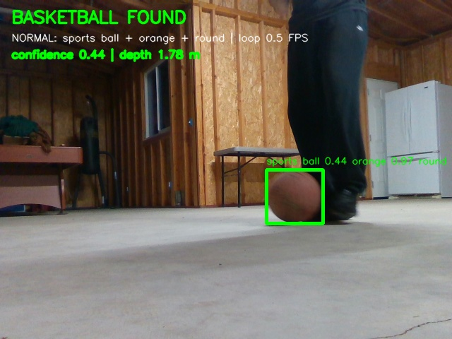

# AAC Vision: Vision-Based Autonomous Tracking Rover

A Raspberry Pi 4 rover that autonomously explores an indoor environment, creates a 2D LiDAR map, detects a standard orange basketball with an Intel RealSense D435 and YOLO, approaches the target, and stops at approximately 0.80 m.

**Main working release:** `src/aacvision_stepwise_basketball_rover_v8_3_smooth_step_approach.py`



## Team

- **Erick Ayala** — software integration, Raspberry Pi configuration, LiDAR mapping, RealSense/YOLO detection, autonomous navigation, testing, and troubleshooting
- **Alex Ahumada** — electrical integration, component selection, wiring, power system, motor/encoder integration, testing, and documentation
- **Jonathan Chavez** — physical chassis design and construction, component mounting, mechanical assembly, and soldered connections

Project group: **AAC Vision**  
California Polytechnic State University, Electrical Engineering Department  
Electrical Engineering Senior Project, July 2026

## Final mission

1. Start the RPLIDAR C1, RealSense D435, motor controller, wheel encoders, and BreezySLAM.
2. Explore using a stop-scan-decide-turn-drive sequence.
3. Continuously update and save a 2D occupancy map.
4. Detect a normal orange basketball using the pretrained YOLO `sports ball` class plus orange/roundness checks.
5. Confirm the target and interrupt exploration.
6. Center the basketball in the camera image.
7. Approach in short, verified steps using depth feedback.
8. Stop near 0.80 m and save an annotated image and final map.

## Hardware

- Raspberry Pi 4
- Intel RealSense D435
- Slamtec RPLIDAR C1
- Four JGB37-520 12 V geared motors with Hall encoders
- Four 80 mm mecanum wheels
- Two DROK/L298 dual H-bridge motor controllers
- 12 V, 5200 mAh battery
- Adjustable buck converter
- Aluminum chassis, approximately 8 in x 12 in
- Approximate assembled weight: 6.7 lb

See [docs/HARDWARE.md](docs/HARDWARE.md) for more detail.
The documented component costs are listed in [docs/BOM.md](docs/BOM.md).

## Software

- Python 3
- OpenCV
- NumPy
- Pillow
- Intel RealSense SDK / `pyrealsense2`
- Ultralytics YOLO with `yolo26n.pt`
- BreezySLAM
- RPLIDAR SDK `ultra_simple`
- `RPi.GPIO`

## Quick start on the Raspberry Pi

The repository assumes the existing virtual environment is located at `/home/pi/aacvision-env` and the RPLIDAR SDK executable is located at `/home/pi/rplidar_sdk/output/Linux/Release/ultra_simple`.

```bash
git clone https://github.com/YOUR-GITHUB-USERNAME/AACVision-Rover.git
cd AACVision-Rover
chmod +x scripts/*.sh
./scripts/check_environment.sh
./scripts/run_v8_3.sh
```

Or run the main program directly:

```bash
/home/pi/aacvision-env/bin/python -u \
  src/aacvision_stepwise_basketball_rover_v8_3_smooth_step_approach.py
```

Press `Ctrl+C` to stop.

## Safety

This code controls a physical rover. Before every floor test:

1. Test with all wheels raised.
2. Keep immediate access to motor power.
3. Keep people, pets, stairs, roads, glass, and fragile objects outside the test area.
4. Verify that left/right motor behavior is correct.
5. Check Raspberry Pi power status:

```bash
vcgencmd get_throttled
```

The desired result is `throttled=0x0`. Do not operate the rover while current undervoltage or throttling is present.

## Saved results

The main program writes results to:

```text
/home/pi/aacvision_maps/
/home/pi/aacvision_basketball_images/
```

The latest annotated camera image is normally:

```text
/home/pi/aacvision_basketball_images/latest_basketball_view.jpg
```

## Repository layout

```text
AACVision-Rover/
├── src/                    Main working V8.3 release
├── experiments/
│   ├── detection/          Detection and reacquisition trials
│   ├── approach/           Fast and continuous approach trials
│   └── navigation/         Frontier and reactive-navigation trials
├── docs/                   Hardware, setup, testing, and version history
├── scripts/                Environment check and launch scripts
└── .github/workflows/      Automatic Python syntax checking
```

## Why V8.3 is the main version

V8.3 provided the best balance observed during testing. It retained the reliable stepwise exploration architecture, detected the basketball with both YOLO and orange-shape evidence, and used short stop-and-recheck approach motions. Faster continuous variants tended to lose the target or overshoot. Stricter detection variants reduced false positives but sometimes rejected the real basketball. More complex navigation variants improved specific obstacle cases but introduced oscillation, excessive turning, or corner-trap behavior.

See [docs/VERSION_HISTORY.md](docs/VERSION_HISTORY.md) for the trial history.

## Publishing this repository

See [docs/PUBLISHING.md](docs/PUBLISHING.md) for the exact GitHub commands.

## License and disclaimer

The source is released under the MIT License. This is a student engineering project and is provided without a warranty of safe or correct operation. See [DISCLAIMER.md](DISCLAIMER.md).
